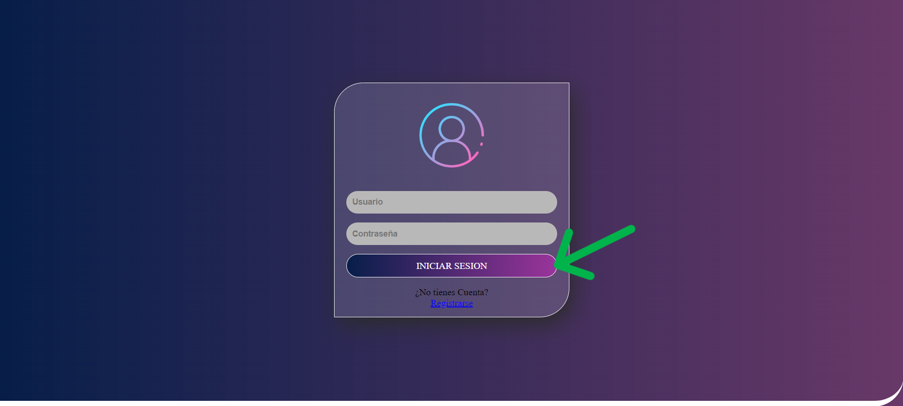
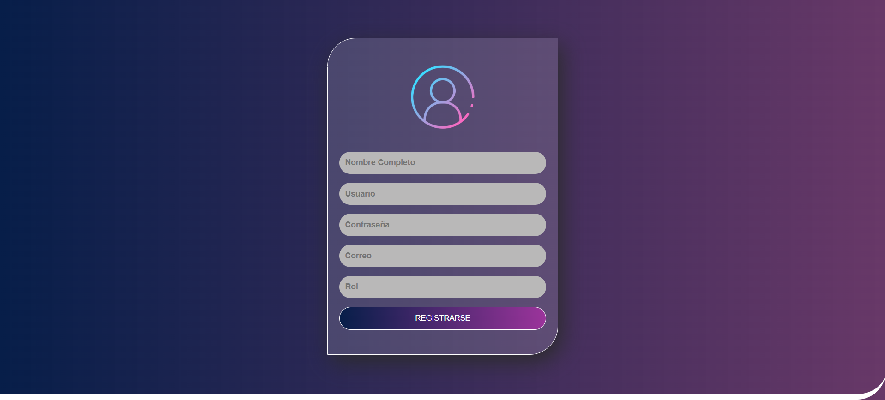
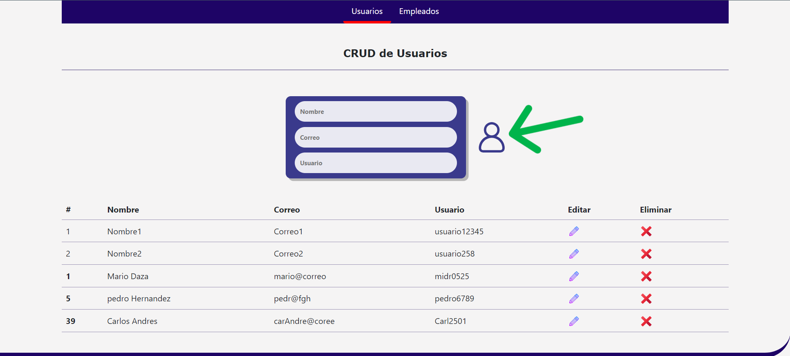
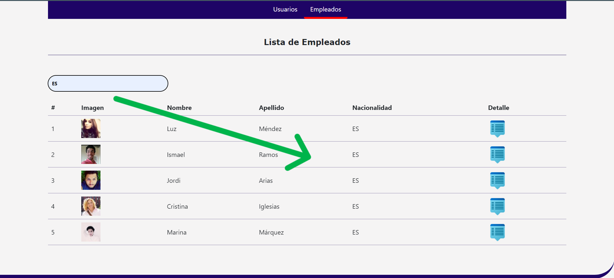

# PruebaBaguerMD 💻

## Descripción 📖

Este proyecto es una aplicación web desarrollada como parte de un ejercicio de práctica para aprender y aplicar conceptos de desarrollo web. La aplicación permite gestionar usuarios y empleados mediante operaciones CRUD (Crear, Leer, Actualizar, Eliminar).

## Funcionalidades 🔑

- **Gestión de Usuarios:** La sección de Usuarios permite realizar operaciones CRUD sobre los usuarios, incluyendo la adición, edición y eliminación de usuarios.
- **Lista de Empleados:** En la sección de Empleados, se muestra una lista de empleados con detalles básicos y enlaces para ver detalles adicionales de cada empleado. Tambien permite filtrr los empleados por nacioanlidad
- **Diseño de Login y Registro**

## Configuración ⚙️

#### Ejecucion del Proyecto: 🚀
🔴 Clonar el Repositorio desde la terminal 
``` bash
  git clone https://github.com/MarioDaza25/PruebaBaguerMD.git
```
🔴 abrir el proyecto e ingresar appsettings.json y colocar las credenciales server,user,password y database de MySql


🔴 Crear la migración con el siguiente comando en la terminal de vsc 
``` bash
  dotnet ef migrations add InitialCreate
```

🔴 Despues generamos el comando de actualizacion para enviar a la base de datos.
``` bash
  dotnet ef database update 
```

🔴 Ejecución de la aplicacion desde la raiz del proyecto.
``` bash
 dotnet watch run 
```

## Diseño Login <i class="fas fa-user"></i>
Diseño de login, con campos de usuario, contraseña, registro e iniciar sesion.

### Click en Iniciar sesion para continuar 🖱️


## Diseño Registro <i class="fas fa-pencil-alt">
Diseño de registro con campos solicitados



## Modulo Usuarios 👥
Modulo de usuarios con funciones para agregar, editar, eliminar y listar usuarios, registrados en la base de datos.

### Agregue usuarios llenando los datos y haciendo click en el boton señalado 🖱️


## Modulo Empleados 👥
Modulo de empleados que permite listar informacion de personas generado por la API https://randomuser.me/ y filtrar segun su nacionalidad como lo indica l aimagen




## Tecnologías Utilizadas
- Frontend: HTML, CSS, JavaScript
- Backend: C#,.NET Core: 
- Base de Datos: MySQL
- Otras herramientas: Bootstrap

## Estructura del Proyecto
- Controllers: Contiene los controladores ASP.NET Core.
- Models: Contiene las clases de modelo de datos.
- wwwroot: Contiene los archivos front (HTML, JS, CSS, imágenes).

## Autor
- Mario Daza


