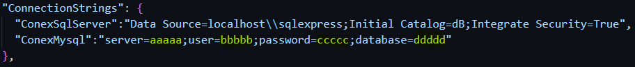

# PruebaBaguerMD

## Descripción

Este proyecto es una aplicación web desarrollada como parte de un ejercicio de práctica para aprender y aplicar conceptos de desarrollo web. La aplicación permite gestionar usuarios y empleados mediante operaciones CRUD (Crear, Leer, Actualizar, Eliminar).

## Funcionalidades

- **Gestión de Usuarios:** La sección de Usuarios permite realizar operaciones CRUD sobre los usuarios, incluyendo la adición, edición y eliminación de usuarios.
- **Lista de Empleados:** En la sección de Empleados, se muestra una lista de empleados con detalles básicos y enlaces para ver detalles adicionales de cada empleado. Tambien permite filtrr los empleados por nacioanlidad

## Configuración

#### Ejecucion del Proyecto:
🔴 Clonar el Repositorio desde la terminal 
```
  git clone https://github.com/MarioDaza25/PruebaBaguerMD.git
```
🔴 abrir el proyecto e ingresar appsettings.json y colocar las credenciales user y password de MySql




🔴 Crear la migración con el siguiente comando en la terminal de vsc 
```
  dotnet ef migrations add InitialCreate
```

🔴 Despues generamos el comando de actualizacion para enviar a la base de datos.
```
  dotnet ef database update 
```

🔴 Ejecución de la aplicacion desde la raiz del proyecto.
```
 dotnet watch run 
```

## Tecnologías Utilizadas

- Frontend: HTML, CSS, JavaScript
- Backend: C#,.NET Core: 
- Base de Datos: MySQL
- Otras herramientas: Bootstrap

## Autor

- Mario Daza


